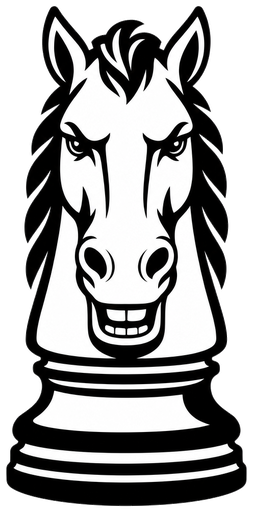
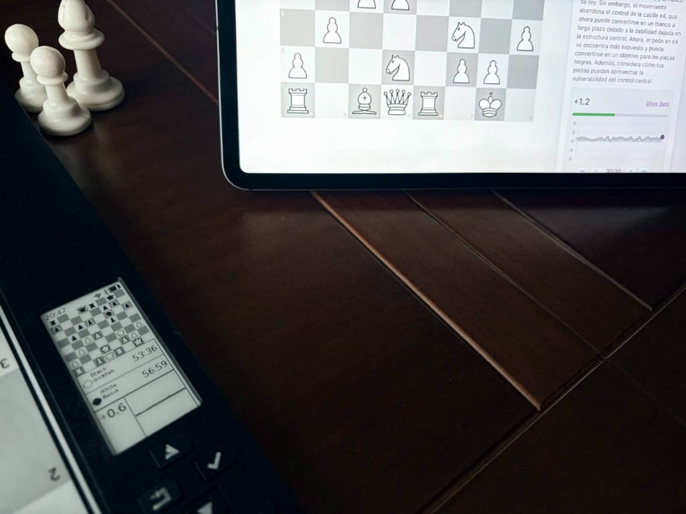

<table>
<tr>
<td width="200" valign="top" align="center">

</td>
<td valign="top">
<h2>Universal-Chess</h2>
<p><em>Look a gift horse in the mouth</em></p>
<p>Universal-Chess is an extensible software platform for electronic chess boards. It currently targets the <strong>DGT Centaur</strong> hardware (as the first supported board), and includes:</p>
<ul>
<li>Local play against engines</li>
<li>AI coaching (experimental &mdash; still rough, can hallucinate, use with a grain of salt)</li>
<li>Game recording/export (PGN)</li>
<li>Online play (Lichess integration)</li>
<li>Board emulation modes (Millennium / Pegasus / Chessnut) for compatible apps</li>
<li>The ability to run the original Centaur software after uploading your original SD image to the new board</li>
</ul>
</td>
</tr>
</table>

## Acknowledgments



Universal Chess exists thanks to the people and projects below.

- **[Adrian Dybwad](https://github.com/adrian-dybwad)** — Creator and lead developer.
- **[Cursor](https://cursor.com)** — AI pair programming used throughout development.
- **Bartolomé Acosta Urrea** — A special thank you for motivation, extensive testing and hands-on help refining the application (**bartok1981** on discord).
- **[DGTCentaur Mods](https://github.com/EdNekebno/DGTCentaur)** — The project Universal Chess is built on, originally created by Ed Nekebno and community contributors.

Special thanks to all the open source chess engine authors whose work makes this project possible.

## Hardware

On DGT Centaur hardware, the stock Raspberry Pi can be replaced with a Raspberry Pi Zero 2 W (or Raspberry Pi Zero W) to enable Wi‑Fi/Bluetooth features and run this software stack. Performance is hugely improved on the Zero 2 W and we highly recommend using it as the Zero W is quite slow although it does work. This software supports the latest version of PI OS (Trixie) and also 32 or 64 bit. 64 bit supports more engines than 32, so we recommend you use that.

**Warranty notice:** Hardware modification may void device warranty. Proceed at your own risk.

## Architecture

The codebase is built on two foundational layers that enable everything else:

**Serial Communication Layer (`sync_centaur.py`)** - Handles all low-level DGT board protocol: packet parsing, command encoding, and an async callback queue for event processing. This provides a clean, reliable interface to the hardware - piece lift/place events, key presses, LED control, and sound.

**E-Paper Display Framework (`epaper/`)** - A composable widget system with a `Manager`, `Scheduler`, and widget hierarchy (`ChessBoardWidget`, `IconMenuWidget`, `GameAnalysisWidget`, etc.). Handles partial refresh scheduling, framebuffer management, and modal widget support. E-paper displays have unique constraints (slow refresh, ghosting, partial update limitations) and this framework abstracts those complexities away.

These foundations enable the higher-level components:
- `GameManager` receives clean piece events and manages chess game logic
- `DisplayManager` composes widgets without worrying about refresh mechanics  
- The menu system, game resume, position loading - all orchestration on top of solid primitives

The project is moving toward a plugin-friendly architecture where board support, emulators, players, and assistants can be extended without rewriting core orchestration.

## Project Status and a Word on Forks and Derivatives and other builds

Forks and derivatives are welcome. Follow the license, clearly label modifications, and ensure end users understand the state of the code.

A number of binaries are included in this repository and are not covered under the general GPL license terms. The GPL license covers the bulk of the Python code. Derivative projects should verify licensing for any bundled binaries.

This project is in beta. Bugs may exist. Issues and reports are welcome.


## Current Features

### Standalone Play
- **Play Engines** - Play against CT800, Zahak, RodentIV, Maia, or Stockfish directly from the board. Supports takebacks, move overrides, and configurable ELO levels. The engine shows its move via LEDs and you execute it on the board.
- **Game Resume** - If the board is shut down mid-game, it automatically resumes where you left off on next startup.
- **Predefined Positions** - Load test positions (en passant, castling, promotion) or puzzles/endgames from the Settings menu. Physical board correction mode guides you to set up the position correctly.

### Board Emulation (Universal)
Universal-Chess can advertise as multiple e-board types and auto-detect which protocol a connected app uses:
- **DGT Revelation II / Millennium** - Use the Centaur as a Bluetooth DGT e-board with apps, Rabbit plugin, Livechess, etc. Works with Chess for Android and Chess.com app (experimental).
- **DGT Pegasus** - Emulate a DGT Pegasus. Works with the DGT Chess app.
- **Chessnut** - Emulate a Chessnut board for compatible apps.
- **Engine Install** - Install your choice of UCI engines via the web interface.
- **AI Coach** - Use your choice of AI engine to coach you - on your level - or to analyse games after the fact.

### Online Play
- **Lichess** - Set your Lichess API token, then play online games directly from the board.

### Web Interface
- **Live Board View** - See the current board position at http://IP_ADDRESS or your board's hostname.
- **PGN Download** - Download all played games as PGN files.
- **Game Analysis** - Playback and analyze played games with takeback support.
- **Video Streaming** - Live MJPEG stream at /video for OBS or other streaming setups.

### Connectivity
- **WiFi** - Join WiFi networks from the board (WPS/WPA2).
- **Bluetooth** - Pair with apps via BLE or Bluetooth Classic.
- **Chromecast** - Stream live board view to Chromecast.
- **Network Drive** - Access files via authenticated WebDAV. The last 100 PGNs are accessible as files.

### Settings
- WiFi configuration, Bluetooth pairing, sound control, Lichess API token, engine selection, and predefined position loading.

## Install procedure

Installing onto a fresh SD card is covered in the
[install guide](https://github.com/adrian-dybwad/Universal-Chess/blob/main/docs/install.md):
Raspberry Pi with Raspberry Pi OS, Orange Pi with Armbian, and the USB-cable
route for a Pi that cannot reach your Wi-Fi. The exact install command for a
given build is on the
[Releases page](https://github.com/adrian-dybwad/Universal-Chess/releases).

## Local development setup (configs and database)

- Active config is read from `/opt/universalchess/config/centaur.ini`. A default template is tracked at `packaging/deb-root/opt/universalchess/defaults/config/centaur.ini`.
- The SQLite database is created at runtime at `/opt/universalchess/db/centaur.db` on first run; it is not tracked in git.
 - The current FEN position is written to `/opt/universalchess/tmp/fen.log` by runtime services.

## Repository layout

- Source (Python package): `src/universalchess/`
- Debian packaging staging root: `packaging/deb-root/`
- Debian install root at runtime: `/opt/universalchess`

## Local Python env (direnv + venv)

- This repo expects the bundled virtualenv at `.venv`. Helper scripts `bin/python` and `bin/pytest` wrap it.
- Auto-activate via direnv:
  1. Install direnv: `brew install direnv`
  2. Ensure shell hook is present:
     ```
     grep -q 'direnv hook zsh' ~/.zshrc || echo 'eval "$(direnv hook zsh)"' >> ~/.zshrc
     source ~/.zshrc
     ```
  3. From repo root, allow: `direnv allow`
- After that, entering the repo activates the venv; run tests with `bin/pytest ...` or python with `bin/python ...`.

## Running locally

- Main app: `./scripts/run.sh` (defaults to `python -m universalchess.main`)
  - Skip auto-update/pull: `./scripts/run.sh --no-update`
- Web UI: `./scripts/run-web.sh`

## Support

Join on Discord: `https://discord.gg/f3DrD6KPM`

## Contributors welcome!
